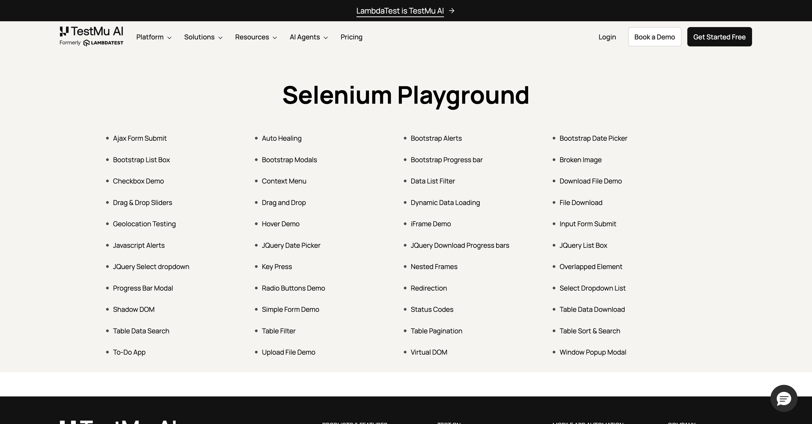

# Hands-on 04: Selenium WebDriver Basics - Setup, Navigation, and Browser Control

A beginner-level hands-on project that demonstrates how to set up a Selenium WebDriver, navigate between pages, manage browser tabs, capture screenshots, and control window dimensions using Python.

## Objective

The goal of this hands-on is to get familiar with the core Selenium WebDriver API. It covers launching a Chrome browser, navigating to a website, clicking elements, asserting URLs, opening and switching between multiple tabs, resizing the browser window, and taking screenshots.

## Concepts Covered

- WebDriver initialization and setup
- Browser maximization and window resizing
- Navigation using `get()`, `back()`, and link clicks
- URL assertion for verification
- Window handle management (multi-tab switching)
- Taking screenshots with `save_screenshot()`
- Retrieving and setting window size
- Basic element location using `By.LINK_TEXT`

## Technologies Used

- Python 3.x
- Selenium WebDriver
- ChromeDriver (managed automatically)
- LambdaTest Selenium Playground (test website)

## Project Structure

```
Hands-on-04/
├── setup_test.py              # Main test script with all scenarios
├── playground_screenshot.png  # Screenshot output from the test run
└── README.md                  # This file
```

- **setup_test.py** - Contains the complete test logic: opening the LambdaTest playground, clicking the Simple Form Demo link, verifying the URL, navigating back, opening a new Google tab, switching between tabs, taking a screenshot, and resizing the browser window.
- **playground_screenshot.png** - A screenshot captured during script execution, saved as proof of the test run.

## Setup Instructions

1.  Clone or download this repository.

2.  Create a virtual environment:

    ```
    python -m venv venv
    source venv/bin/activate   # On Windows: venv\Scripts\activate
    ```

3.  Install the required packages:

    ```
    pip install selenium
    ```

    Optionally, create a `requirements.txt` with the contents below if you want a clean install:

    ```
    selenium
    ```

    Then run:

    ```
    pip install -r requirements.txt
    ```

4.  Make sure you have Google Chrome installed. The script uses ChromeDriver which is expected to be available in your system PATH, or it will auto-resolve if using a compatible Selenium version.

## Running Tests

Execute the script directly with Python:

```
python setup_test.py
```

There is no pytest setup for this hands-on. It is a standalone script meant to be run as shown above.

## Expected Output

When the script runs successfully, you should see the following printed in the console:

```
URL assertion passed.
Open Tabs: ['<tab1_handle>', '<tab2_handle>']
Google Tab Title: Google
Screenshot saved successfully.
Current Window Size: {'width': <current_width>, 'height': <current_height>}
Updated Window Size: {'width': 1280, 'height': 800}
```





The script also:

- Opens the LambdaTest Selenium Playground website.
- Clicks on "Simple Form Demo" and verifies the URL contains "simple-form-demo".
- Navigates back to the playground homepage.
- Opens a second tab with Google and switches to it.
- Takes a screenshot named `playground_screenshot.png`.
- Resizes the browser to 1280x800 pixels.
- Closes the browser automatically.

## Framework Design

This project does not follow a formal test framework or design pattern like Page Object Model. It is a single script meant for learning the Selenium WebDriver API step by step. The code is linear and uncommented on purpose so that beginners can trace the execution flow easily.

## Notes

- The LambdaTest Selenium Playground is a third-party website. If its structure changes, the link text locator (`Simple Form Demo`) may need updating.
- The script uses `time.sleep()` for waits instead of explicit or implicit waits. This is not a production practice but keeps the learning example simple.
- ChromeDriver version must match your installed Chrome browser version. If you encounter errors, update ChromeDriver or use WebDriver Manager.
- The script manually manages window handles. If the website opens unexpected pop-ups, the tab count may differ.

## Learning Outcome

After going through this hands-on, a beginner will:

- Know how to initialize a Selenium WebDriver and open a browser.
- Understand how to navigate to URLs and click on elements.
- Learn how to assert current URLs for test verification.
- Get hands-on experience with browser tab management using window handles.
- Be able to take screenshots and control window dimensions programmatically.
- Gain confidence to move on to more structured test automation projects.
