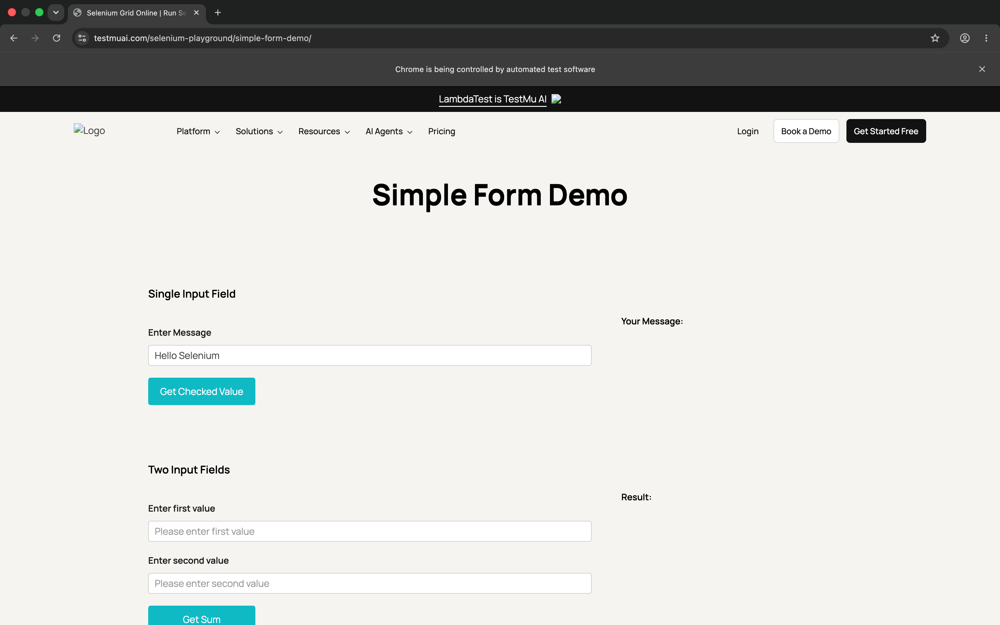

# Selenium Pytest Basic Tests

A hands-on project that demonstrates writing Selenium WebDriver tests using Pytest with explicit waits and automated failure debugging. The tests run against the LambdaTest Selenium Playground.

## Objective

The goal is to learn how to write automated browser tests using Selenium WebDriver with Pytest. This includes setting up a WebDriver session, writing test cases with explicit waits, capturing debug evidence when tests fail, and generating HTML test reports.

## Concepts Covered

- Selenium WebDriver session setup and teardown using Pytest fixtures
- Explicit waits using WebDriverWait and expected conditions
- Locator strategies (ID, CSS Selector)
- Assertions for element state (text, selected status)
- Debug evidence capture on test failure (screenshots and page source)
- HTML report generation with pytest-html
- Automated WebDriver management with webdriver-manager

## Technologies Used

- Python
- Selenium WebDriver
- Pytest
- Pytest-HTML
- WebDriver Manager
- Google Chrome

## Project Structure

```
Hands-on-06/
├── conftest.py                 # Pytest fixture for WebDriver setup/teardown
├── test_playground.py          # Test file with all test cases
├── requirement.txt             # Python dependencies
├── debug_output/               # Auto-generated folder for failure evidence
│   ├── simple_form_message_failure.html
│   └── simple_form_message_failure.png
├── Output_src/                 # Expected output reference screenshots
│   ├── Screenshot 2026-07-22 at 9.56.16 PM.png
│   └── Screenshot 2026-07-22 at 9.56.25 PM.png
└── README.md                   # This file
```

### Folder and File Descriptions

**conftest.py** - Defines a `driver` fixture that creates a maximized Chrome WebDriver instance before each test and quits it after the test finishes. Uses webdriver-manager to automatically download and manage the ChromeDriver binary.

**test_playground.py** - Contains all test cases and a helper function `_save_debug_evidence()` that captures a screenshot and the page source HTML when a test fails. The base URL points to the LambdaTest Selenium Playground.

**requirement.txt** - Lists the Python packages needed to run the project: selenium, pytest, pytest-html, and webdriver-manager.

**debug_output/** - Created automatically by the debug helper when a test fails. Stores the screenshot (.png) and the HTML page source (.html) at the moment of failure. This helps with debugging without needing to rerun the test.

**Output_src/** - Contains reference screenshots showing the expected test output for comparison.

## Output Image





## Setup Instructions

1. **Create a virtual environment:**

   ```bash
   python3 -m venv venv
   source venv/bin/activate
   ```

   On Windows:

   ```bash
   python -m venv venv
   venv\Scripts\activate
   ```

2. **Install dependencies:**

   ```bash
   pip install -r requirement.txt
   ```

   Note: The file is named `requirement.txt` (without the 's'), so make sure to use the correct filename.

## Running Tests

Run all tests:

```bash
pytest
```

Run all tests with verbose output:

```bash
pytest -v
```

Run tests and generate an HTML report:

```bash
pytest --html=report.html --self-contained-html
```

Run a specific test:

```bash
pytest test_playground.py::test_simple_form_submission -v
```

## Expected Output

When you run `pytest -v`, both tests should pass. The output should look similar to this:

```
test_playground.py::test_simple_form_submission PASSED
test_playground.py::test_checkbox_demo PASSED
```


Each test performs the following:

- **test_simple_form_submission** - Opens the Simple Form Demo page, types "Hello Selenium" into the message field, clicks the "Show Message" button, and verifies that the displayed message matches the entered text.
- **test_checkbox_demo** - Opens the Checkbox Demo page, clicks the first checkbox to check it, verifies it is selected, clicks it again to uncheck, and verifies it is deselected.

If a test fails, a screenshot and the page HTML source are saved in the `debug_output/` folder for debugging.


## Framework Design

This project uses a flat, script-based test structure. It is not built with the Page Object Model pattern. Test logic, locators, and assertions are all written directly inside the test functions.

The `conftest.py` file provides a `driver` fixture using Pytest's fixture mechanism. The fixture is automatically called before each test and the WebDriver is quit after the test finishes. The `webdriver-manager` library handles downloading the correct version of ChromeDriver for the installed Chrome browser.

The `_save_debug_evidence()` function in the test file provides a simple debugging mechanism. It is called inside except blocks when explicit waits time out, capturing the browser state at the point of failure.

## Notes

- The tests run against the **LambdaTest Selenium Playground**, which is a third-party website. The site layout, element IDs, and CSS classes may change over time. If a test fails unexpectedly, inspect the page to check if locators need to be updated.
- The tests are written for **Google Chrome**. If you use a different browser, you will need to update the WebDriver setup in `conftest.py`.
- The `webdriver-manager` library automatically matches the ChromeDriver version to your installed Chrome browser. If you run into driver compatibility issues, make sure both Chrome and webdriver-manager are up to date.
- This is a learning project. It is not intended for production use or CI/CD pipelines.
- The requirement file is named `requirement.txt` (without 's'), which is a minor naming difference from the standard `requirements.txt`.

## Learning Outcome

After completing this hands-on, you will be able to:

- Set up a Selenium WebDriver project with Pytest from scratch
- Write test cases with explicit waits for reliable element interaction
- Use Pytest fixtures for browser session management
- Capture debug evidence automatically when tests fail
- Generate HTML test reports using pytest-html
- Run Selenium tests from the command line with different options
